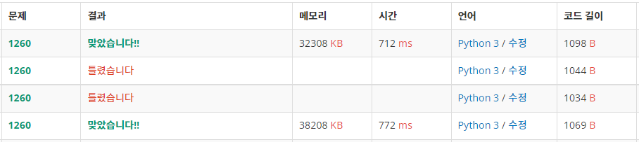

## 문제
그래프를 DFS로 탐색한 결과와 BFS로 탐색한 결과를 출력하는 프로그램을 작성하시오. 단, 방문할 수 있는 정점이 여러 개인 경우에는 정점 번호가 작은 것을 먼저 방문하고, 더 이상 방문할 수 있는 점이 없는 경우 종료한다. 정점 번호는 1번부터 N번까지이다.

## 입력
첫째 줄에 정점의 개수 N(1 ≤ N ≤ 1,000), 간선의 개수 M(1 ≤ M ≤ 10,000), 탐색을 시작할 정점의 번호 V가 주어진다. 다음 M개의 줄에는 간선이 연결하는 두 정점의 번호가 주어진다. 어떤 두 정점 사이에 여러 개의 간선이 있을 수 있다. 입력으로 주어지는 간선은 양방향이다.

## 출력
첫째 줄에 DFS를 수행한 결과를, 그 다음 줄에는 BFS를 수행한 결과를 출력한다. V부터 방문된 점을 순서대로 출력하면 된다.

## 예제 입력 1 
```
4 5 1
1 2
1 3
1 4
2 4
3 4
```

## 예제 출력 1 
```
1 2 4 3
1 2 3 4
```

## 풀이
처음에는 edge 정보 자체로 리스트에 둬서 해결하려고 접근했는데, 명확한 방식이 떠오르지 않았다.
BFS/DFS 및 그래프 문제 풀이가 처음인 점과 풀이에 시간이 길어짐에 따라, 다른 사람의 풀이 과정을 분석하였다.
아래 세 블로그를 위주로 참고하였다.

[블로그 1](https://jun-itworld.tistory.com/18) [블로그 2](https://jokerldg.github.io/algorithm/2021/03/22/dfs-bfs.html) [블로그 3](https://sarah950716.tistory.com/12)

상대적으로 인접행렬을 활용한 풀이가 많다고 보여 인접행렬부터 접근하였다.

우선 0으로 초기화된 N x N (N=정점(node)의 수) 행렬을 선언한다.
간선(edge) 정보에 따라 행렬의 (u, v), (v, u) 위치마다 1을 표기한다. 가령 1-2 간선 정보가 있다면, 행렬 (1,2), (2,1) 위치에 1을 표기한다.
리스트 discovered에 탐색된 노드를 추가해가면서 마지막 탐색된 노드 번째 행을 기준으로 재귀적으로 탐색하면 DFS고, 해당 노드를 이후 작업을 위한 큐에 추가하면 BFS이다.

인접리스트는 인접행렬 대신에 간선 정보를 리스트로 저장하는 방식으로, graph[u]에 v 추가, graph[v]에 u 추가하는 방식이다.

그래도 스스로에게 뿌듯했던 점은 인접리스트 방식에 가깝게 접근하고 있었다는 사실이었다. 이후에 bfs, dfs 구현 자체를 어떻게 하는지를 몰랐을 뿐이지.


추가로, 맨 아래는 인접행렬, 맨 위는 인접리스트로 풀어본 결과이다.
단편적으로 해석하자면 인접리스트는 상대적으로 메모리 사용량이 적고 해당 문제 상황에서는 적은 시간에 결과를 얻어낼 수도 있어보인다.
이후에 시간복잡도와 공간복잡도도 계산하는 방법을 공부해보고 싶다.