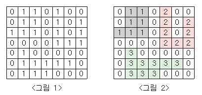

## 문제
[그림 1](Figure 1.png)과 같이 정사각형 모양의 지도가 있다. 1은 집이 있는 곳을, 0은 집이 없는 곳을 나타낸다. 철수는 이 지도를 가지고 연결된 집의 모임인 단지를 정의하고, 단지에 번호를 붙이려 한다. 여기서 연결되었다는 것은 어떤 집이 좌우, 혹은 아래위로 다른 집이 있는 경우를 말한다. 대각선상에 집이 있는 경우는 연결된 것이 아니다. [그림 2](img2.png)는 [그림 1](Figure 1.png)을 단지별로 번호를 붙인 것이다. 지도를 입력하여 단지수를 출력하고, 각 단지에 속하는 집의 수를 오름차순으로 정렬하여 출력하는 프로그램을 작성하시오.



## 입력
첫 번째 줄에는 지도의 크기 N(정사각형이므로 가로와 세로의 크기는 같으며 5≤N≤25)이 입력되고, 그 다음 N줄에는 각각 N개의 자료(0혹은 1)가 입력된다.

## 출력
첫 번째 줄에는 총 단지수를 출력하시오. 그리고 각 단지내 집의 수를 오름차순으로 정렬하여 한 줄에 하나씩 출력하시오.

## 예제 입력 1 
```
7
0110100
0110101
1110101
0000111
0100000
0111110
0111000
```

## 예제 출력 1
```
3
7
8
9
```

## 풀이
지도 상의 각 원소를 하나의 노드로 취급하여 그래프를 형성하였다.
특정 노드 n의 동서남북 방향으로 값이 1인 노드가 존재하면 해당 노드 k와 연결된다고 간주하여 그래프 정보를 저장하였다.
만들어진 그래프에서 모든 노드를 탐색하도록 하여, 그 과정에서 단지의 수(`nodes while loop의 횟수`) 및 각 단지에 속하는 집의 수를 출력한다.

다만 최적화 가능성이 있는 부분들은 더 고민해볼 필요가 있다.
가령, 7 x 7 지도는 49 x 49 크기의 그래프 정보를 생성한다. 그리고 탐색에 최대 O(n^3)의 시간 복잡도를 가진다.
이를 줄이는 방법을 찾고 접근해볼 필요가 있다.